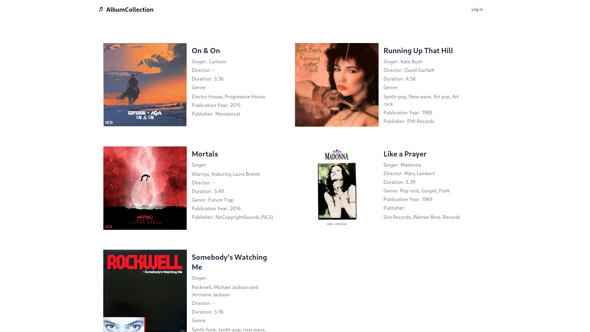

# 🎵 PHP Music App



A simple PHP application that displays music albums from a MySQL database.  
Access is restricted to logged-in users only. Built with **Bootstrap 5**, **Composer**, and follows a clean MVC-like structure.

⚠️ This project is created solely for fun and learning don't use it in production.

## Requirements

- PHP 8.0+
- Composer
- MySQL (or MariaDB)

## Setup Instructions

1. **Clone the repository**

   ```bash
   git clone https://github.com/blueorionn/album-collection.git
   cd album-collection
   ```

2. **Install dependencies**

   ```bash
   composer install
   ```

3. **Configure environment**

   ```bash
   DB_HOST="your-database-host"
   DB_NAME="your-database-name"
   DB_USER="your-database-username"
   DB_PASSWORD="your-database-password"
   DB_PORT="your-database-port"
   ```

4. **Run the development server**

   ```bash
   php -S localhost:8000 -t public
   ```

5. **Login**

   Use credentials:

   ```bash
   Username: ray
   Password: admin
   ```

## License

This project is released under the MIT License.
